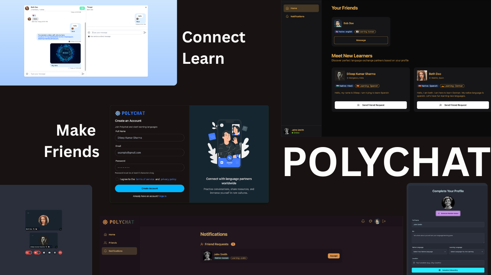
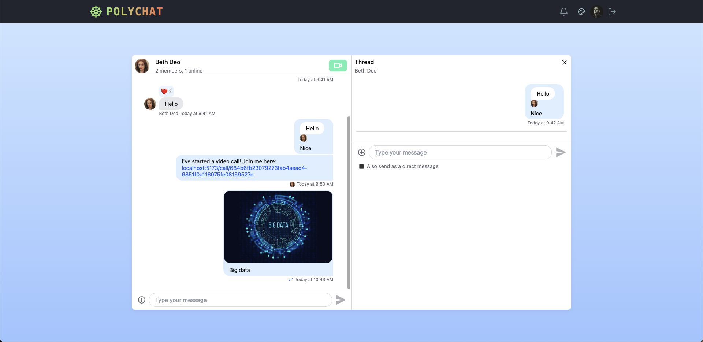
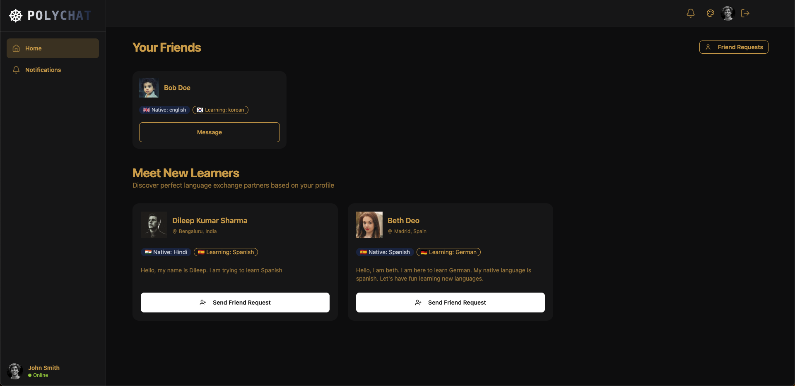
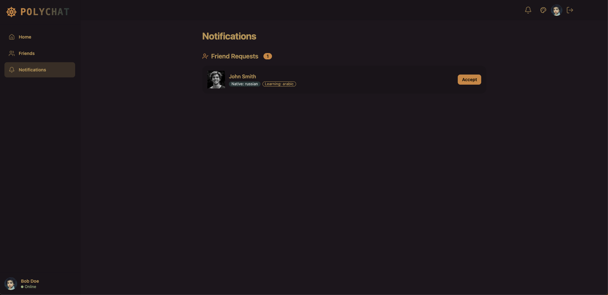
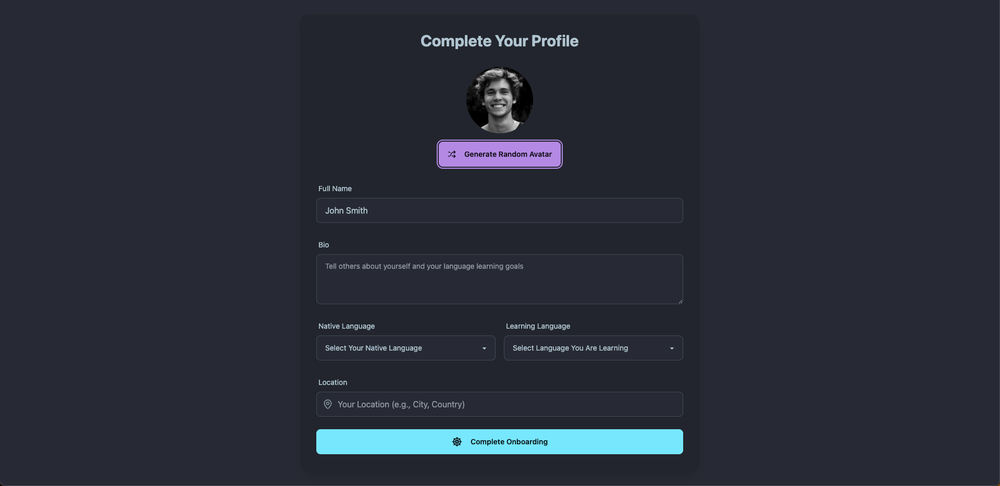
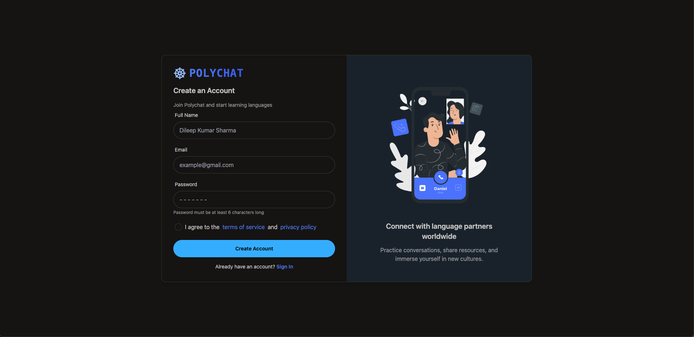

# 🌐 PolyChat – Learn Languages Through Real Conversations

**PolyChat** is a full-stack web application designed to help users around the world connect and learn new languages together through direct messaging, video calling, and profile-based matchmaking. Inspired by the idea of cultural exchange and real-time immersion, PolyChat simplifies the process of finding language partners and fosters interactive learning experiences.

---

## 🔗 Live Demo

🟢 [Launch App](https://polychat-y4lb.onrender.com/login)

---

## 📸 Screenshots

### 🌟 Main Preview



### 💬 Key Interfaces

| Video Call                      | Messaging                       | Home                            |
| ------------------------------- | ------------------------------- | ------------------------------- |
|  |  |  |

| Notifications                                   | Onboarding                                  | Signup                              |
| ----------------------------------------------- | ------------------------------------------- | ----------------------------------- |
|  |  |  |

---

## 🧩 Problem Statement

Most language learning apps rely heavily on isolated lessons, leaving users with poor real-world conversational skills.

**PolyChat** solves this by:

- Connecting users globally for authentic language exchange
- Offering live 1:1 chat and video sessions
- Matching based on native and target languages
- Fostering meaningful interaction through curated profiles

---

## 🔍 Features

- 👤 **JWT-based Authentication**
- 🌐 **Profile-driven Language Matching**
- 💬 **Real-time Messaging (Stream Chat SDK)**
- 🎥 **Video Calling (Stream Video SDK)**
- 🔔 **Live Friend Requests & Notifications**
- 🌓 **Dark Mode UI & Responsive Design**

---

## ⚙️ Tech Stack

### 🔧 Backend – `Express.js` + `MongoDB`

- Express.js
- MongoDB + Mongoose
- JWT, bcrypt.js
- dotenv, cors, cookie-parser
- Stream Chat SDK

### 🎨 Frontend – `React.js` + `Vite`

- React 19, Vite
- Zustand for state management
- Tailwind CSS + DaisyUI
- React Router v7
- TanStack Query (React Query)
- Stream Chat & Video SDKs
- Lucide React icons, React Hot Toast

---

## 📁 Project Structure

```bash
polychat/
│
├── backend/                # Node.js + Express API
│   ├── src/
│   │   ├── server.js       # Entry point
│   │   └── routes/         # Auth & user APIs
│
├── frontend/               # Vite + React frontend
│   ├── src/
│   │   ├── pages/          # Home, Chat, Notifications
│   │   ├── components/     # UI elements
│   │   └── hooks/          # Zustand + API hooks
└── screenshots/            # UI previews for GitHub
```

---

## 🧪 Installation

### Prerequisites

- Node.js ≥18
- MongoDB Atlas or local instance
- Stream API credentials

### Backend

```bash
cd backend
npm install
cp .env.example .env  # Fill in credentials
npm run dev
```

### Frontend

```bash
cd frontend
npm install
npm run dev
```

---

## 🔐 Environment Variables

```env
PORT=5000
MONGO_URI=your_mongodb_connection_string
JWT_SECRET=your_secret
STREAM_API_KEY=your_key
STREAM_API_SECRET=your_secret
```

---

## 📈 Advantages

- 🌍 Promotes authentic language exchange
- 💬 Builds fluency through conversation
- 🔁 Scalable, modular full-stack architecture
- 🎨 Stunning dark-themed UI with intuitive UX
- 💡 Easy to extend with features like AI bots, translation, and analytics

---

## 🌱 Future Scope

- 🌐 Live translation for multilingual calls
- 🧠 AI language tutors and practice agents
- 👥 Group rooms & open conversation forums
- 📊 Personalized learning analytics
- 🔄 Scheduled peer sessions & gamification

---

## 🙌 Credits

- [Stream.io](https://getstream.io) – Chat & Video SDK
- [Tailwind CSS](https://tailwindcss.com/)
- React, Zustand, and other open source packages

---

## 💡 Inspiration

Created with the mission of **breaking language barriers through real human connection**.
